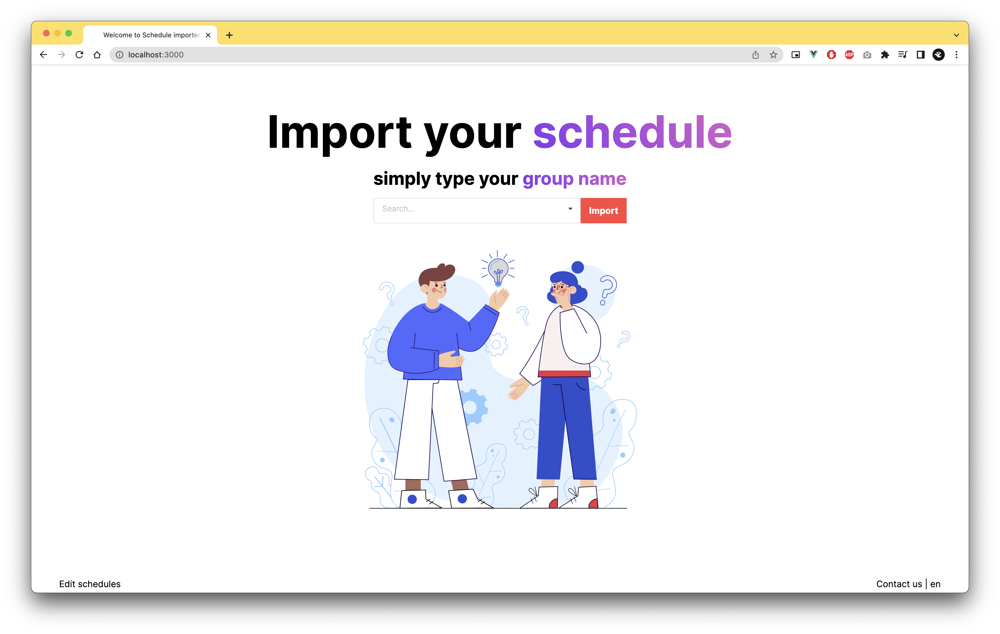
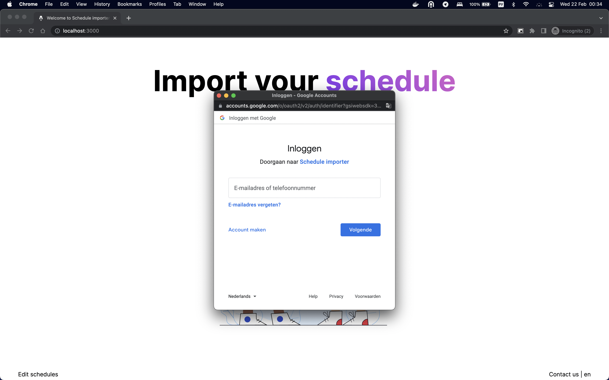
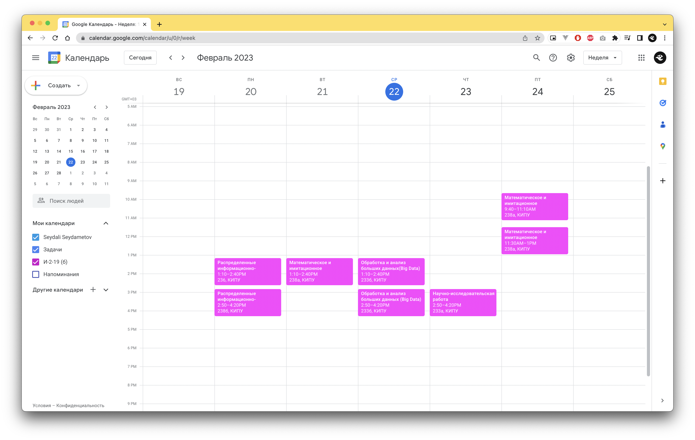
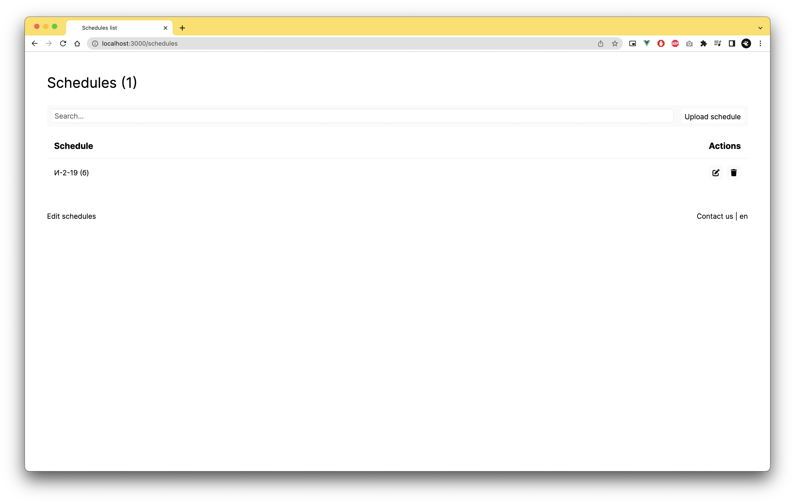
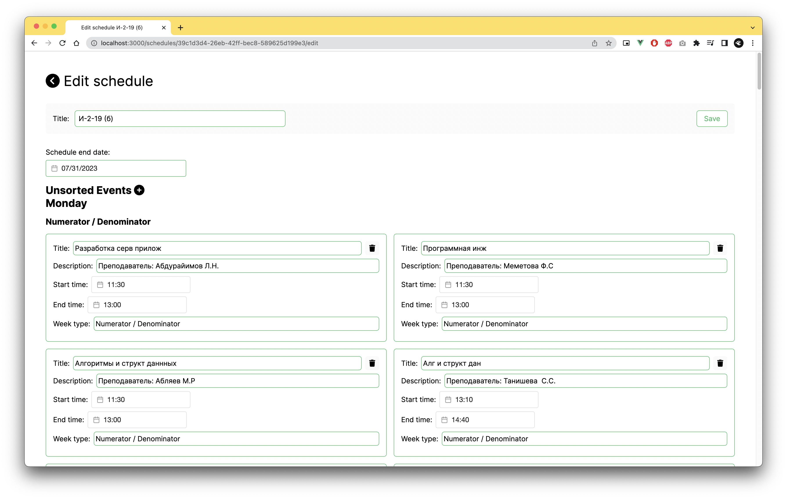

# About Schedule importer

СEPU(Crimean Engineering and Pedagogical University, name of University) Schedule importer is the app for students developed by me for handy classes schedule import to calendar.

It provides simple design with simple functionality. On main page we have searchable input, where you can put your group name.

Then you have to press ‘import’ button to start magic happen.

Log in using Google and you can see the result.

And you have your class schedule imported. Enjoy it!

## Tech-side

All the schedules are provided to students in .xls format. So, we have to parse it, and my app does it using backend written by me using Nest.js. And frontend have interface to manage all imported schedules for any faculty and group. And it looks like this, yep, that simple.

And concrete schedule edit page looks like this.

That was my project.

**Tools i used:**

**Frontend:**

- Astro.js
- Vue.js
- Google analitycs
- Google one tap auth
- I18n

**Backend:**

- Nest.js
- Node.js
- PostgreSQL
- Docker (for postgreSQL)
- TypeORM

**DevOps:**

Dockerfile’s for frontend and backend

docker-compose.yml for easy deploy to everywhere

I know code is not perfect and we always have things to get done, be refactored, etc. But i was developing this project using all the skills that i have at the time. 

I learned something new like astro.js and dockerfile’s / docker-compose and i happy with that.

And, i have to finish tests :)